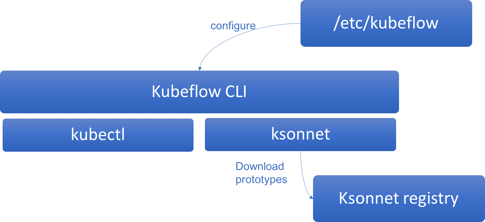

## Motivation
Data scientists and machine learning practitioners don't want to go through kubernetes and ksonnet in general or even docker to train/deploy ML models. Currently, a single line of code change will require a whole new cycle of creating a new docker image, uploading it to a docker registry, download it to kubernetes cluster, create a new tfjob kube manifest and deploy it.
To solve these issues and bridge the gap between machine learning and kubeflow, we propose a kubeflow CLI, which will accepts commands and arguments and build/deploy end to end ML models accordingly.

## Goals

- kubeflow users should be able to train, deploy, monitor and get logs of running jobs using simple commands like `kubeflow train`, `kubeflow logs`, `kubeflow deploy`...
- use fast prototyping allowing code injection into docker without rebuilding docker images which will remove unecessary container image builts.

## Non-Goals
use and reuse datasets if already exsitant from different sources (S3, GCs, minio..).

## Design

## Alternatives Considered

- helm instead of ksonnet: kubeflow itself is installed with ksonnet.
- operator for kubeflow: two layers of abstractions makesit hard to debug root cause of issues.

